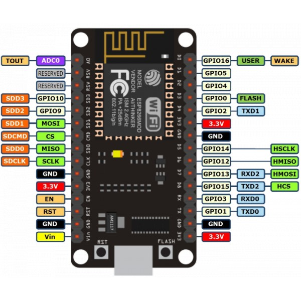

# _GPIO Example_

_This test code shows how to configure gpio and how to use gpio interrupt._

## GPIO functions

 * GPIO15: output
 * GPIO16: output
 * GPIO4:  input, pulled up, interrupt from rising edge and falling edge
 * GPIO5:  input, pulled up, interrupt from rising edge.  

## How to use example

### Hardware Required

  

 * Connect GPIO15 with GPIO4
 * Connect GPIO16 with GPIO5

### Configure the project

```
make menuconfig
```

* Set serial port under Serial Flasher Options.


### Build and Flash

Build the project and flash it to the board, then run monitor tool to view serial output:

```
make -j4 flash monitor
```

(To exit the serial monitor, type ``Ctrl-]``.)

See the Getting Started Guide for full steps to configure and use ESP-IDF to build projects.

## Example Output  

 * Generate pulses on GPIO15/16, that triggers interrupt on GPIO4/5

```
I (0) gpio: GPIO[15]| InputEn: 0| OutputEn: 1| OpenDrain: 0| Pullup: 0| Pulldown: 0| Intr:0
I (0) gpio: GPIO[16]| InputEn: 0| OutputEn: 1| OpenDrain: 0| Pullup: 0| Pulldown: 0| Intr:0
I (0) gpio: GPIO[4]| InputEn: 1| OutputEn: 0| OpenDrain: 0| Pullup: 1| Pulldown: 0| Intr:1
I (0) gpio: GPIO[5]| InputEn: 1| OutputEn: 0| OpenDrain: 0| Pullup: 1| Pulldown: 0| Intr:1
I (0) main: cnt: 0

I (1) main: cnt: 1

I (1) main: GPIO[4] intr, val: 1

I (1) main: GPIO[5] intr, val: 1

I (2) main: cnt: 2

I (2) main: GPIO[4] intr, val: 0

I (3) main: cnt: 3

I (3) main: GPIO[4] intr, val: 1

I (3) main: GPIO[5] intr, val: 1

I (4) main: cnt: 4

I (4) main: GPIO[4] intr, val: 0

I (5) main: cnt: 5

I (5) main: GPIO[4] intr, val: 1

I (5) main: GPIO[5] intr, val: 1

I (6) main: cnt: 6

I (6) main: GPIO[4] intr, val: 0
```
